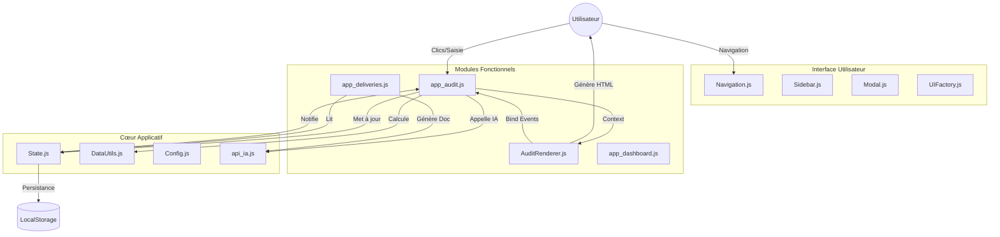

# Documentation Technique - Projet Ezio

**Ezio** est une application web "Local-First" conçue pour la gestion d'audits, la création de formulaires dynamiques et le pilotage assisté par Intelligence Artificielle.

---

## 1. Stack Technique
Le projet est construit avec une stack minimaliste et robuste pour assurer une exécution sans dépendances complexes ni étape de build.

*   **HTML5 / CSS3** : Structure et design responsif (Variables CSS, Flexbox/Grid).
*   **JavaScript (Vanilla ES6+)** : Logique applicative native.
*   **Librairies Externes** (via CDN) :
    *   `Chart.js` : Visualisation de données (Dashboard).
    *   **Visualisation** : `Chart.js` pour le Dashboard.
*   **Fonts** : `Inter` (Corps) et `Outfit` (Titres) via Google Fonts.
*   **Design** : Approche "Premium" avec variables CSS (Thèmes Clair/Sombre), Glassmorphism et Ombres portées.
*   **Stockage** : `localStorage` pour la persistance des données et `JSON` pour l'import/export.

---

## 2. Architecture des Fichiers

### Diagramme de Flux (Architecture Simplifiée)



### Core & Structure
*   `index.html` : Point d'entrée unique. Charge le module principal via `<script type="module" src="js/main.js">`.
*   `js/main.js` : Point d'entrée JavaScript. Initialise l'application et les modules.
### Core & Structure (`js/core/`)
*   `State.js` : **État Global**. Singleton gérant les données de l'application (`currentForm`, `reportsStore`) et la persistance (`Store.js`).
*   `Utils.js` : Helpers basiques (slugify, escapeHtml, **debounce**) et extensions de prototypes.
*   `DataUtils.js` : **Logique Métier Pure**. Contient les algorithmes de tri, filtrage, recherche et traitement des données. Totalement découplé du DOM.
*   `UIFactory.js` : **Composants UI**. Bibliothèque de générateurs d'éléments (Boutons, Badges, Toasts) pour une UX cohérente. Remplace les `alert()` par des Toasts.
*   `Config.js` : Constantes (Couleurs, Seuils, Valeurs par défaut).
*   `Schemas.js` : Validation et structures de données par défaut.

### UI & Navigation (`js/ui/`)
*   `Navigation.js` : Orchestrateur des vues et initilialisation des modules.
*   `Sidebar.js` : Gestionnaire générique de listes latérales.
*   `Modal.js` : Service de fenêtres modales.
*   `MarkdownEditor.js` : Composant d'édition de texte enrichi (WYSIWYG) avec barre d'outils et conversion Markdown. Utilisable en mode Standard (Livrables) ou Compact (Audit).
*   `DOM.js` : Cache des sélecteurs DOM fréquents.

### Modules Fonctionnels (`js/modules/`)
1.  **Module Audit (`app_audit.js` & `AuditRenderer.js`)** :
    *   **Contrôleur (`app_audit.js`)** : Gère les événements utilisateurs, les appels API (IA) et la manipulation de l'état via `State.js`.
    *   **Vue (`AuditRenderer.js`)** : Génère le HTML du tableau. Intègre le `MarkdownEditor` dynamique pour les cellules "Réponse" et "IA". Utilise la **Délégation d'Événements** sur le conteneur principal pour gérer les clics performants sur des milliers de cellules.
    *   **Logique** : Délègue le tri/filtre complexe à `DataUtils.js`.

2.  **Module IA (`js/api/api_ia.js`)** :
    *   Couche d'abstraction vers les LLMs.
    *   Supporte **LM Studio** (Local), **OpenAI**, **Groq**.
    *   **Spécificité LM Studio** : Transforme le payload standard en une structure "plate" (`input: [{type:'text'}]`) pour maximiser la compatibilité avec les contextes longs locaux.

3.  **Module Dashboard (`app_dashboard.js`)** :
    *   Génération de KPIs dynamiques via une **Modale de configuration** avancée (édition de titre, axe principal, axe secondaire).
    *   **Croisements Dynamiques** : Support des graphiques empilés ou groupés en croisant **n'importe quelles colonnes** du formulaire (listes déroulantes, champ libre, etc.).
    *   **DataLabels & Pourcentages** : Intégration de `chartjs-plugin-datalabels` pour l'affichage optionnel des valeurs. Sélecteur intégré pour afficher en **Valeur brute** ou en **Pourcentage (%)** (avec redimensionnement dynamique de l'axe X pour les barres horizontales).
    *   **Optimisation** : Réutilise les instances `Chart.js` via `chart.update()` pour éviter le scintillement lors des rafraîchissements et de l'édition (⚙️).

4.  **Module Créateur (`app_creator.js`)** :
    *   Outil de configuration pour transformer un JSON plat importé en structure Ezio.
    *   Définition des types de colonnes, paramètres IA (prompts), schémas de couleurs.
    *   **Ajout dynamique de colonnes** : Possibilité d'étendre la structure existante directement depuis l'interface.

5.  **Module Modèles (`app_models.js`)** :
    *   Interface de gestion (CRUD) du fichier `models.json`.
    *   **Propriétés Étendues** : Gère la propriété `locked` (empêche la suppression de modèles par défaut, visible via 🔒) et la propriété `outil` (rend le modèle disponible comme Outil IA rapide dans l'éditeur Markdown, visible via 🛠️).
    *   **Test de Connexion** : Vérifie la validité des crédenitals et récupère la liste des modèles disponibles via l'API du provider.

6.  **Module Rapports (`app_reports.js` & `ReportsRenderer.js`)** :
    *   Gestion des **Modèles de Rapports** (Templates) et configuration des **Modules IA** de la bibliothèque.
    *   Architecture **MVC** : `ReportsRenderer.js` construit toute l'interface HTML et gère la "délégation d'événements", tandis que `app_reports.js` conserve l'état métier.
    *   *Note :* Ce module ne génère plus de contenu direct, il sert uniquement à définir des structures réutilisables.

7.  **Module Livrables (`app_deliveries.js`)** :
    *   **Moteur de Génération** : Instancie un modèle de rapport pour créer un livrable unique.
    *   **Workflow Moderne** : Utilise `async/await` pour la gestion fluide des flux IA.
    *   **UX / WYSIWYG** : Éditeur de texte enrichi intégré (`MarkdownEditor.js`) avec barre d'outils visuelle (Titres, Listes, Gras, Outils IA) convertissant le HTML en Markdown. Comprend une fenêtre modale d'**Outils IA** permettant des traitements contextuels rapides (ex: traduction, correction) via les modèles configurés comme "outils".
    *   **Performance** : Sauvegarde des entrées texte temporisée (**Debounce**).
    *   **Fonctionnalités** : Configuration du Scope, Prompt, Modèle IA, Widgets à exporter, et option Tableau furtive (greffée à l'export).
    *   **Persistance** : Stockage dans l'objet `reports` du fichier d'audit.

8.  **Module Export (Data) (`app_export.js`)** :
    *   Gestion de l'export des données brutes (JSON d'état complet, CSV pour Excel).
    *   *Note :* L'export documentaire (Word/PPT) est désormais géré par le module Impression.
    *   Utilisation de l'API `Blob` pour générer le fichier et déclencher le téléchargement navigateur sans backend.
73: 
74: 9.  **Module Output Word (`app_output_word.js`)** :
75:     *   **Export Word Avancé** : Génère des fichiers `.docx` depuis les données de l'application.
76:     *   **Support des Modèles** : Capable de charger un template utilisateur (`.docx`/`.dotx`), de parser son XML interne et d'injecter (greffer) le contenu généré à un emplacement spécifique (tag `{{CONTENT}}`), préservant ainsi toute la mise en page d'origine.
77:     *   **Librairies** : Utilise `docx` pour la génération de contenu et `JSZip` pour la manipulation des archives Word.

10. **Module Impression & Output (`app_outputppt.js`, `app_output_word.js`)** :
    *   **Interface Unifiée** : Bouton "Impression" dans le header ouvrant une modale de sélection de format (Word/PPT) et de modèle.
    *   **Configuration Centralisée** : Fichier `output_config.json` gérant à la fois les templates PowerPoint (`templates`) et les modèles Word (`documents`).
    *   **Génération PPTX Avancée** : Crée des présentations PowerPoint natives via `PptxGenJS`. Supporte la création organique d'une slide de couverture (`TITRE`), d'intercalaires de sections (`CHAPITRE`), et de contenu (`SLIDE`). Le moteur inclut un algorithme de **Pagination Intelligente (Overflow)** qui scinde automatiquement les longs textes Markdown et génère de nouvelles diapositives à la volée. Intègre et formate automatiquement les Tableaux furtifs sur des slides dédiées.
    *   **Formatage des Tableaux (PPTX & Word)** :
        *   Les cellules de type "Combo" (listes déroulantes) de l'Audit injectent automatiquement leur schéma de couleur (`colorScheme`) dans le code HTML Markdown.
        *   Les moteurs Word et PPTX interceptent ces couleurs HTML à la volée, colorisant nativement l'arrière-plan des cellules exportées et adaptant la couleur de police pour un contraste optimal.
        *   `output_config.json` permet de structurer un objet `tableFormat` par template PPTX (en-tête, bordures, zébrage).
    *   **Génération Word** : Injecte le contenu Markdown généré dans des modèles Word (`.docx`) existants en préservant la mise en page. Intègre et formate automatiquement les Tableaux furtifs.
    *   **Export Widgets** : Les graphiques sélectionnés parmi vos widgets Dashboard sont automatiquement téléchargés sous forme d'images PNG séparées lors de l'Impression Word ou PPT, proprement nommées et prêtes à être glissées dans vos documents.

11. **Outil d'Extraction PowerPoint (`extract.html`)** :
    *   **Utilitaire Autonome** : Script exécutable localement en glisser-déposer.
    *   **Rétro-Ingénierie** : Parse les archives `.pptx` brutes pour en extraire la structure XML (`p:spTree`, `a:t`).
    *   **Génération de JSON** : Produit un objet JSON compatible avec `output_config.json` contenant précisément la taille (`layout`), le fond, les marges (`points`), et les couleurs de police (`srgbClr`, `schemeClr`) du masque d'origine, évitant la configuration manuelle fastidieuse du layout PptxGenJS.

### Styles (`css/`)
*   `style_shared.css` : Styles globaux, variables, layout de base. **Gestion des Z-Index** : Header (2000) > Sidebar (10) > Contenu.
*   `style_audit.css`, `style_dashboard.css`, `style_creator.css` : Styles spécifiques par module.
*   `style_reports.css` : Styles pour l'éditeur de templates.
*   `style_deliveries.css` : Styles pour le générateur de livrables.
*   `style_models.css` : Styles pour la page modèles.
---

## 3. Structure des Données (JSON)

L'état de l'application (`currentForm`) repose sur une structure JSON standardisée :

```json
{
  "columns": [
    {
      "id": "col_1",
      "label": "Conformité",
      "type": "combo", // ou 'question', 'ia', 'qcm'...
      "visible": true,
      "params": {
         "options": ["Oui", "Non", "N/A"],
         "colorScheme": "alert3"
      }
    }
  ],
  "rows": [
    // Tableau de tableaux (valeurs des cellules)
    ["Chapitre 1", "Question A", "Oui", "..."]
  ],
  "statics": [
    // Widgets du Dashboard
    { "id": "widget_1", "vizType": "pie", "columnId": "col_1" }
  ],
  "deliveries": [
    // Instances de rapports générés
    {
      "id": "dlv_123",
      "name": "Rapport Mensuel - Janvier",
      "structure": [ 
          {
              "sourceId": "mod_1",
              "config": {
                  "ai": { "prompt": "...", "model": "..." },
                  "scope": { "type": "chapter", "selection": ["Chap A", "Chap B"] },
                  "columns": ["col_1", "col_3"],
                  "isTable": true
              },
              "result": "Contenu généré..."
          }
      ]
    }
  ]
}
```

---

## 4. Gestion des Rapports & Livrables

L'application distingue désormais la définition du modèle de l'exécution du rapport :

*   **Rapports (Templates)** : Définis dans `reports.json`. Ce sont des structures simplifiées contenant uniquement la liste des IDs des modules à inclure (ex: `["mod_intro", "mod_compliance"]`).
*   **Livrables (Instances)** : Stockés dans le fichier d'audit (`currentForm`). Ce sont des copies complètes des modules, enrichies avec les prompts spécifiques et les résultats générés par l'IA. Au moment de la création d'un livrable, l'application récupère la configuration par défaut de chaque module depuis la bibliothèque.

---

## 5. Configuration & Modèles IA

### Stockage (`models.json`)
C'est le fichier maître pour la configuration des LLM. Il est chargé par `app_audit.js` et `app_creator.js`.
```json
[
  {
    "nom": "Modèle local",
    "provider": "lmstudio",
    "endpoint": "http://localhost:1234/api/v1/chat",
    "model": "qwen-2.5-7b",
    "prompt": "Tu es un auditeur expert..."
  }
]
```

### Note sur `config.json`
Un fichier `config.json` était utilisé précédemment pour charger une configuration globale (`IA_CONFIG`). Bien que le code de chargement existe encore dans `app_shared.js` (souvent commenté ou inutilisé), la logique actuelle privilégie `models.json` pour une gestion multi-modèles plus flexible.

---

## 6. Détails Techniques - Flux IA

Le système utilise une approche **RAG Contextuel (Retrieval-Augmented Generation)** simplifiée, opérant ligne par ligne.

### Structure du Message (Interne)
Dans `app_audit.js` (`runIA`), le message est construit ainsi :
```javascript
const messages = [
    { "role": "system", "content": "Prompt Système (défini dans models.json)" },
    { "role": "user", "content": [
        "Prompt Utilisateur (défini dans la colonne)", 
        { "Conformité": "Non", "Preuve": "..." } // Objet de contexte
    ]}
];
```

### Transformation pour l'API
Le service `api_ia.js` adapte ce format selon le provider.
*   **Standard (OpenAI/Groq)** : Sérialise le tableau `content` en une seule chaîne JSON stringifiée.
*   **LM Studio (`lmStudioDirect`)** : Éclate le message en segments de texte distincts :
    ```json
    "input": [
        { "type": "text", "content": "System Prompt..." },
        { "type": "text", "content": "User Prompt..." },
        { "type": "text", "content": "Conformité:\nNon" }
    ]
    ```
    Cette méthode contourne certaines limitations de parsing des petits modèles locaux.

### Flux IA - Module Livrables (IA Globale)
Le module Livrables utilise un **RAG Global (Batch)** :
1.  **Construction du Contexte** :
    *   Récupère les lignes selon le Scope (Global/Chapitre).
    *   Filtre les colonnes sélectionnées.
    *   Génère un **Tableau Markdown** (`| Col1 | Col2 |...`).
2.  **Message Utilisateur** : Composite `[Instruction, Tableau Markdown]`.
3.  **Sortie** : L'analyse IA est stockée dans la vue "Résultat". Si l'option "Tableau" est active, le tableau Markdown du contexte est mémorisé secrètement sans surcharger l'Aperçu/Éditeur. Il n'apparaîtra complété de sa structure que lors de l'export final (Impression Word/PPT ou Export Markdown).

---

## 7. Gestion Dynamique des Lignes

### Fonctionnement
*   **Duplication** : Utilisable sur toutes les lignes via le bouton `+`. La nouvelle ligne est une copie profonde (`deep copy`) des données, insérée immédiatement après la ligne source.
*   **Contraintes** :
    *   Les champs `Réponse`, `IA`, `Combo` (sélection) sont réinitialisés.
    *   Les champs `Question` deviennent **éditables** (`textarea`) pour permettre la personnalisation.
    *   Les `QCM` conservent les options mais sont décochés.
*   **Suppression** : Uniquement possible pour les lignes ajoutées (identifiées par métadonnée).

### Structure des Données (`rowMeta`)
Pour distinguer les lignes d'origine des lignes ajoutées, une propriété `rowMeta` a été ajoutée à l'objet `currentForm`.
```json
{
  "rows": [ ... ],
  "rowMeta": [
    {},              // Ligne d'origine (vide)
    { "isAdded": true } // Ligne dupliquée
  ]
}
```
Ce tableau est synchronisé par index avec le tableau `rows`.

